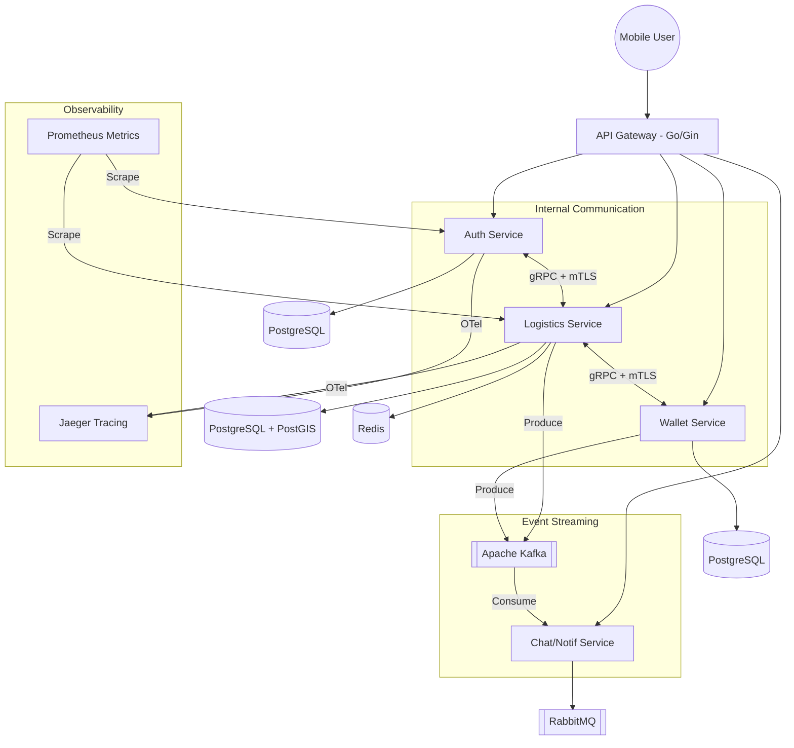

# Architecture Design

## 1. System Architecture: Microservices
โปรเจกต์นี้ใช้โครงสร้างแบบ Microservices เพื่อแยกความรับผิดชอบและรองรับการขยายตัว (Scalability)

## 2. Backend Pattern: Hexagonal Architecture (Ports & Adapters)
เพื่อให้โค้ดมีความยืดหยุ่นและทดสอบได้ง่าย (Testability)

- **Domain (Core):** บรรจุ Business Logic และ Entities (Pure Go).
- **Application (Use Cases):** ประสานงานระหว่าง Domain และส่วนติดต่อภายนอก.
- **Infrastructure (Adapters):** ส่วนที่ติดต่อกับ Database, gRPC, External APIs.

## 3. Mobile Pattern: Clean Architecture
- **Presentation:** UI Widgets และ Riverpod Providers.
- **Domain:** Business Logic (Use Cases) และ Entities.
- **Data:** Repository implementations และ Data Sources (Remote/Local).

## 4. Design Patterns & Principles

### SOLID Principles (การประยุกต์ใช้)
- **S - Single Responsibility:** แต่ละ Microservice รับผิดชอบเพียงหนึ่ง Domain (เช่น Auth, Wallet) และแต่ละ BLoC จัดการเพียงหนึ่ง Feature หน้าจอ.
- **O - Open/Closed:** ใช้ Interfaces/Abstract Classes สำหรับ Repository เพื่อให้ขยายฟังก์ชันได้ (เช่น เพิ่มระบบจ่ายเงินใหม่) โดยไม่ต้องแก้โค้ดเดิม.
- **L - Liskov Substitution:** ตัวอย่างเช่น `StripePaymentAdapter` และ `PromptPayAdapter` ต้องสามารถถูกสลับที่กันได้ภายใต้ Interface `PaymentPort`.
- **I - Interface Segregation:** ไม่สร้าง Interface ที่ใหญ่เกินไป แต่แยกเป็นหน่วยย่อยๆ (เช่น `LocationReader`, `LocationWriter`).
- **D - Dependency Inversion:** High-level modules (Business Logic) จะไม่ขึ้นตรงกับ Low-level modules (Database/HTTP) แต่จะขึ้นตรงกับ Abstractions (Interfaces) แทน.

### Patterns
- **Saga Pattern:** จัดการ Distributed Transactions ข้าม Microservices.
- **Outbox Pattern:** รับประกันการส่ง Message ไปยัง Message Broker.
- **Repository Pattern:** abstraction ของการเข้าถึงข้อมูล.
- **Dependency Injection:** ใช้ในทั้ง Go และ Flutter เพื่อลด Tight Coupling.
